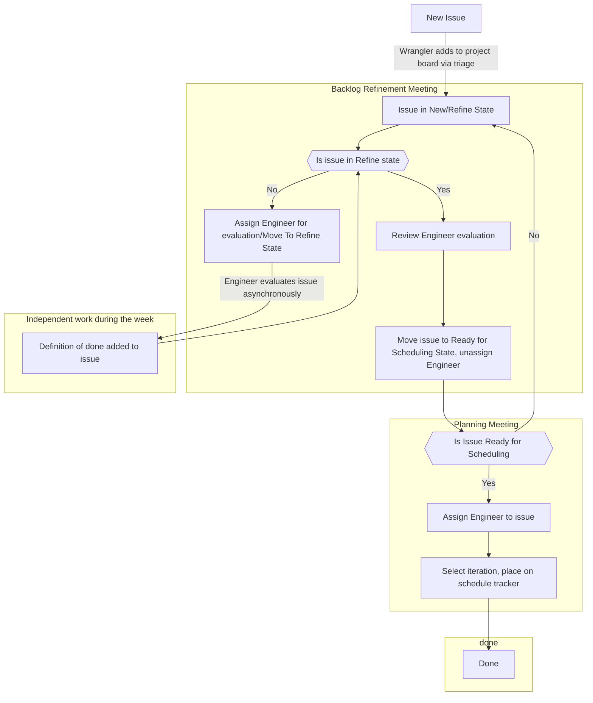

# Project Board Handbook
## Introduction
**OpenSSL Project Board** handbook is a practical guide to understanding the
project and our concerted effort towards achieving objectives. Contained within,
you'll find detailed information about our methodologies, expected outcomes,
team member responsibilities, and timelines. This resource aims to streamline
our operations and ensure consistency across the board.

Beyond serving as a facilitative tool for our project process, this handbook
also complements our time-based release policy[^1].

## Flowchart for evaluating/scheduling Items on the project board

## Work Item (Task) Statuses
In the lifecycle of a work item, it moves through several statuses that reflect
its progress within the project workflow.

Understanding these statuses is essential for tracking the progress of work
items and managing project workflow efficiently. It is vital to ensure that each
work item moves through these stages in a manner that aligns with our project
management methodology.

Here are the key statuses that a work item can have:

1. **New:** This status indicates that a work item has been recently introduced
   to the project. These tasks need further triage before they can be assigned
   for completion.
2. **Refine:** This status is used when a task requires immediate priority for
   analysis. It signifies the need for accelerated consideration in order to
   address essential aspects of the project.
3. **Backlog:** Tasks in this status are already analyzed but have not been
   scheduled for a particular iteration yet. They are prioritized by their
   position in the backlog list.
4. **To Do:** Tasks with this status are scheduled for an iteration and are
   ready to be worked on.
5. **In Progress:** This status signifies that a task is currently being worked
   on.
6. **In Review:** Once a task's execution phase is complete, it moves into the
   In Review status. This stage involves verifying the task's completion and
   quality.
7. **Done:** This status signifies the successful completion of a work item.
8. **Rejected:** This status indicates that a task has been evaluated and deemed
   unnecessary or not feasible at the current time. Tasks may be rejected during
   the refinement or review process.

## Views
Our Project Board features various Views, each catering to a specific aspect of
our project management strategy. They include "Epics", "Next", "Refine", "Plan",
"Iterate", "Me", "WG", and "OMC".

The lifecycle of a work item typically flows from "Epics", through "Next",
"Refine", "Plan", and ends up in "Iterate". Detailed descriptions of each view's
unique function and role within the project are presented below.

### 1. Me:
This is your personal workspace where you can track tasks and updates relevant
to your role in the project. It highlights tasks that have been directly
assigned to you, providing a centralized location to manage your individual
responsibilities and contributions.

Moreover, this view displays a Custom Field called "Context". The Context field
is crucial for differentiating project development tasks from administrative and
governance tasks. These types of tasks are tracked in separate individual views,
ensuring clear segmentation and efficient management of various project aspects.

### 2. Iterate:[^2]
The Iterate view is an integral part of the Development Phase[^1] of our
project. This phase is divided into two-week iterations, which start on Friday
and end on Thursday. Displayed as a classic Kanban board, the Iterate view is
designed to provide clear visibility of the project's ongoing progress. The
board features four columns: "To Do", "In Progress", "In Review", and "Done".
Each column reflects the status of tasks within the current iteration, giving an
instant overview of where each task stands in the development cycle. This
visibility helps identify bottlenecks and ensures smooth task transition.

Further clarity is enhanced by the assignment details displayed for each task.
This allows a quick overview of who is responsible for each task, thus fostering
accountability and promoting project progress.

Task cards also display their estimated complexity[^3], a measure determined
during the planning and refinement stages. If a new task is introduced during an
iteration, it's essential not to estimate its complexity unless it had already
been evaluated and planned for future iterations.

When a task reaches "Done" status, it is incumbent on the individual who
completed the task to perform a reality check. If the actual complexity of the
task deviated from the original estimate, they must update both the estimation
and the "original estimation" field. This practice helps improve the accuracy of
future estimations and enables us to spot potential planning issues early on.

Task cards also contain additional relevant information such as linked Pull
Requests, an indication if the task slipped from a previous sprint, and the
associated Epics under which the tasks are tracked. This information contributes
to a comprehensive understanding of each task and its context, helping to manage
the project more effectively.

The ultimate goal is to ensure all tasks reach the "Done" status by the end of
each iteration. Maintaining this discipline is key to preserving a predictable
delivery schedule, thus enabling us to meet our project milestones in a timely
manner.

### 3. Plan: 
The Plan view serves as a crucial tool in planning for upcoming iterations. We
utilize this view during our iteration planning meetings. It lays out a
comprehensive visualization of our strategic roadmap, highlighting tasks that
are ready to be worked on and detailing their distribution across future
iterations. In this view, each task is clearly marked to indicate if it has been
planned for a specific iteration and whether it's been assigned to a particular
team member. This clear delineation of tasks facilitates strategic task
assignment and ensures that everyone on the team has visibility of their
responsibilities.

A key feature of the Plan view is the inclusion of a backlog. Here, tasks that
have not yet been designated to a particular iteration are listed under a
"Backlog" status. These tasks are not just aimless floaters; they are organized
in a priority-driven manner.

The priority of each backlog task is determined by its placement in the list -
the higher up the task, the higher its priority. This list provides a clear
roadmap for team members, helping them understand which tasks should be tackled
first once they are ready to move on to new tasks.

Altogether, the Plan view provides a bird's eye view of the project's
trajectory, allowing for effective resource planning and better anticipation of
upcoming tasks and challenges.

### 4. Refine:
The Refine view is the initial hub for all new tasks assigned to the project,
and it plays a pivotal role during our backlog refinement meetings. Each new
task enters this view with a "New" status, signifying its fresh addition to the
project. During these meetings, we delve into each task, dividing it into
manageable segments and estimating its complexity. This breakdown process
establishes a clear understanding of the task's scope, which assists in more
accurate scheduling and resource allocation.

Sometimes, it's essential to fast-track the analysis of a specific task. For
this, we utilize the "Refine" status, marking a task for immediate attention and
giving it a higher priority in the analysis process.

Furthermore, during this refinement stage, tasks can be linked to existing
Epics. Epics represent larger deliverables and are used to track their progress
separately. By assigning tasks to Epics, we can monitor the delivery of
significant features or components more efficiently, providing better visibility
and control over the project's overall progress.

By effectively managing task statuses, prioritizing when necessary, and linking
tasks to Epics, the Refine view helps streamline our development workflow,
optimizing task management, and enhancing project tracking.

### 5. Next:
The Next view is a pivotal component during the Release Definition[^1] phase of
our project, acting as a key instrument for the release steering committee[^4].
Items that carry the "next" label land in this view, denoting their importance
for the forthcoming project releases. These can range from small tasks to large
Epics, but regardless of size, they all bring unique aspects or value to the
project and the community.

The release steering committee uses the Next view to select and prioritize work
for the next release. This helps streamline the planning process and ensure that
the project stays on track and delivers consistent value.

### 6. Epics:
Epics are substantial project components that often contain multiple related
tasks. The Epics view is used to track the progress of these significant
elements. It shows the status of each Epic, including how many tasks are
complete and how many remain.

Additionally, this view displays the individual responsible for each Epic. This
assignment helps maintain accountability within the team.

### 7. WG:
WG stands for Working Group, a broader collective encompassing OpenSSL project
paid and volunteer resources. This expansive group enhances the project's
comprehensive view, which includes a traditional Kanban board employed to manage
and monitor the progress of OpenSSL Project's administrative and governance
tasks. However, some of these tasks, containing sensitive data, may not be
publicly visible due to confidentiality requirements. As a group, we are
committed to operating openly and transparently, hence everything that can be
made public will be made public.

### 8. OMC:
The OMC view refers to a dedicated board to manage and track tasks specific to
the OpenSSL Management Committee (OMC). A comprehensive list of such work can be
found in the [OpenSSL Bylaws document].

[^1]: [Time-based Release Policy](https://www.openssl.org/policies/general/release-policy.html)
[^2]: **Iteration** serves the same purpose as **Sprint**, a term prevalent in
    the Scrum methodology. We used Iteration as it's the default field name in
    GitHub Projects.
[^3]: Expressed using the Fibonacci sequence (1, 2, 3, 5, 8, 13, 21, etc.)
[^4]: Release Steering Committee - A group comprised of four individuals: one
    internal member from OpenSSL, two specially invited representatives from the
    community, and the engineering manager. This committee is dedicated to
    guiding the release cycle, defining release priorities, and authorizing
    release backlog modifications.

[OpenSSL Bylaws document]: https://www.openssl.org/policies/omc-bylaws.html#OMC
